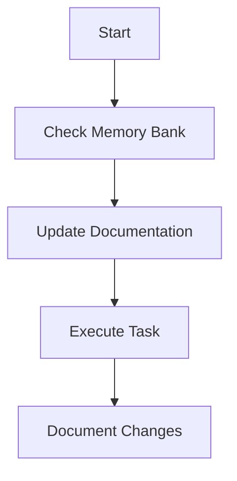

# Gemini Memory for PyroVue Project

## Project Summary

The core goal of the PyroVue project is to develop a modular, open-source kiln controller. It will use a K-type thermocouple to read kiln temperature, display the reading on an onboard TFT, and eventually be capable of closed-loop fuel control.

## Memory Bank

This project uses a `memory-bank` directory to store detailed information about the project. The following files are used to provide context for development:

*   `@./memory-bank/progress.md`: A running log of the project's progress. Use this to understand what works, what's left to build, the current status, known issues, and the evolution of project decisions.
*   `@./projectbrief.md`: The foundational document that shapes all other files. It defines the core requirements and goals and is the source of truth for the project scope.
*   `@./memory-bank/systemPatterns.md`: Describes the system architecture, key technical decisions, design patterns, component relationships, and critical implementation paths.
*   `@./memory-bank/techContext.md`: Details the technologies used, development setup, technical constraints, dependencies, and tool usage patterns.

### Workflow

### Memory Bank Updates

Memory Bank updates occur when:
1.  Discovering new project patterns
2.  After implementing significant changes
3.  When user requests with **update memory bank** (MUST review ALL files)
4.  When context needs clarification

## AI Interaction

*   The AI assistant cannot directly build or upload code.
*   The AI assistant must pause and wait for user confirmation on success or failure of a build/upload.